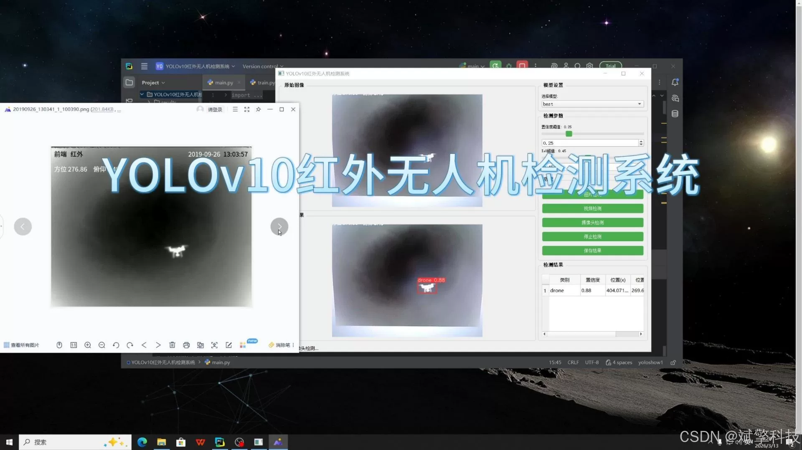
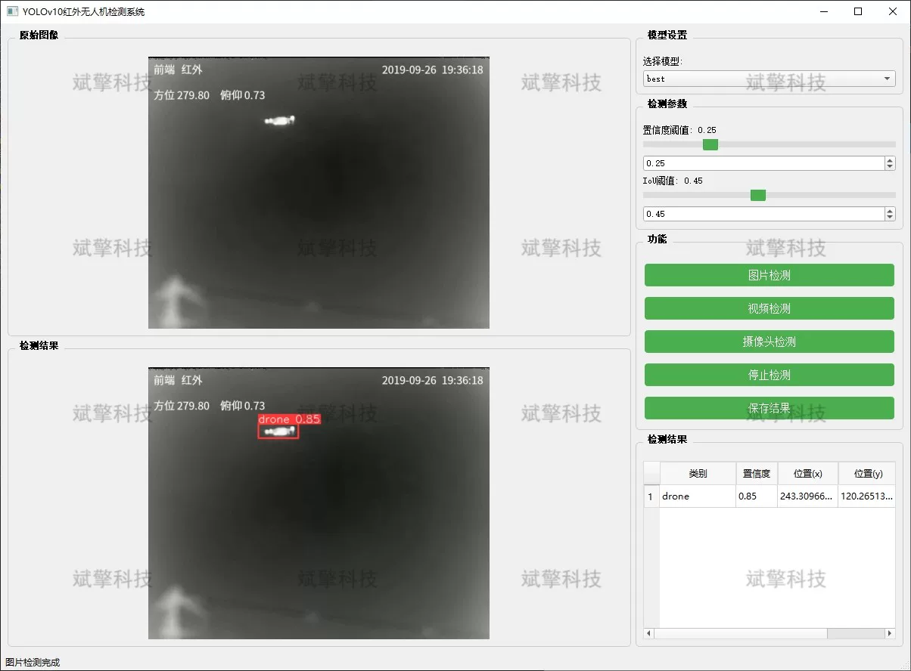
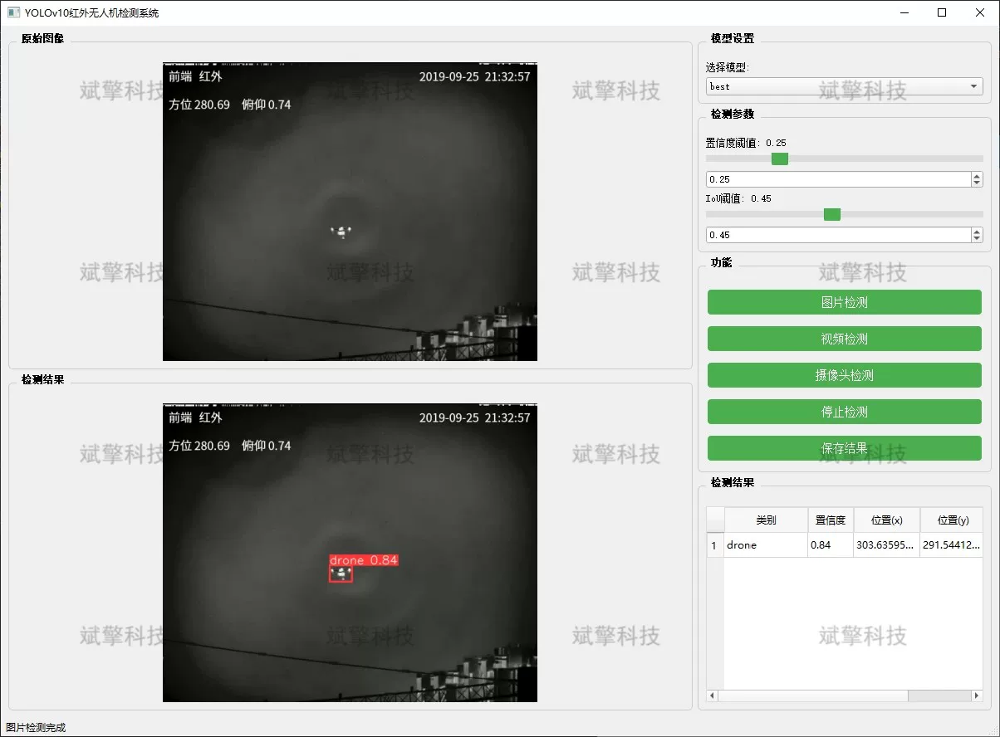
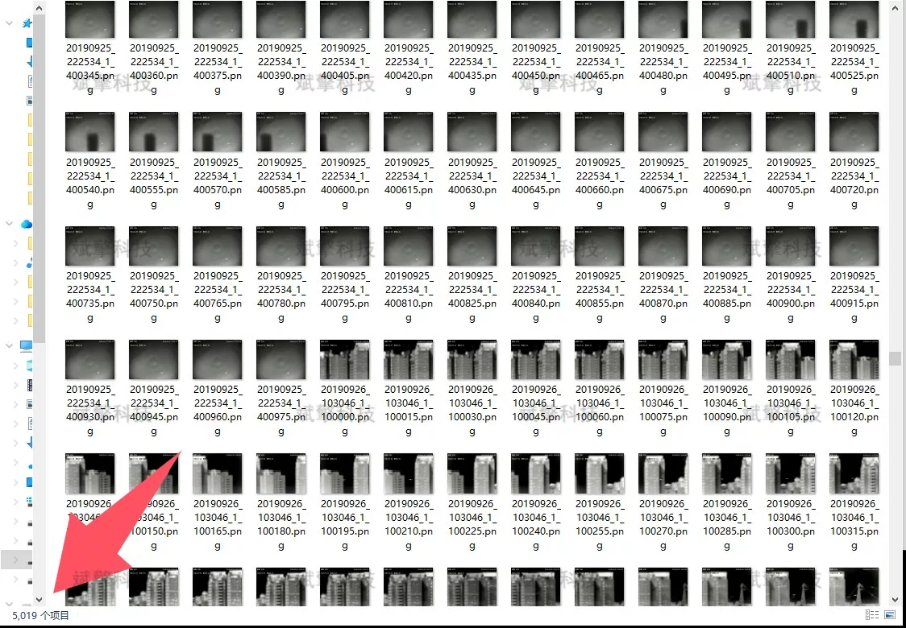
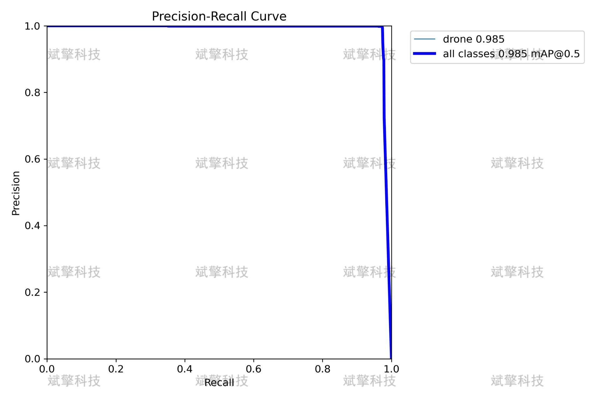
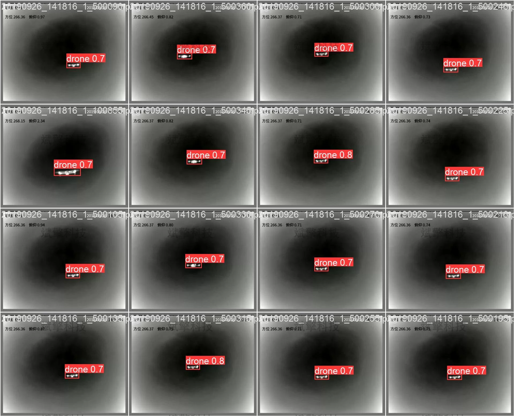

# YOLOv10 Infrared Drone Detection System

## Body

YOLOv10 Infrared Drone Detection System, based on the advanced YOLOv10 object detection algorithm, has been developed to create a drone detection system specifically for infrared scenes. This system utilizes deep learning techniques to accurately and promptly identify and locate drone targets in infrared thermal imaging. The project implements three detection modes: images, videos, and real-time camera streams, featuring high precision and frame rate capabilities. It provides an efficient and intelligent solution for low-altitude security, military reconnaissance, and night patrol applications.

System Features
✅ Image Detection: Capable of detecting images and returning detection boxes and category information.
✅ Video Detection: Supports video file input to analyze each frame in the video.
✅ Real-Time Camera Detection: Connects USB cameras to achieve real-time monitoring.
✅ Parameter Real-Time Adjustment (Confidence and IoU Thresholds)
Dataset Introduction
Training set (Train): Total 5019 images
Validation set (Val): Total 1233 images

## Images

## Payment

Here is a pay link on Stripe ( https://buy.stripe.com/3cs8yP7sY87d0vu9AB ). Please contact me lonlonago@foxmail.com after funding $89, and I will send you a complete data files , thank you!

